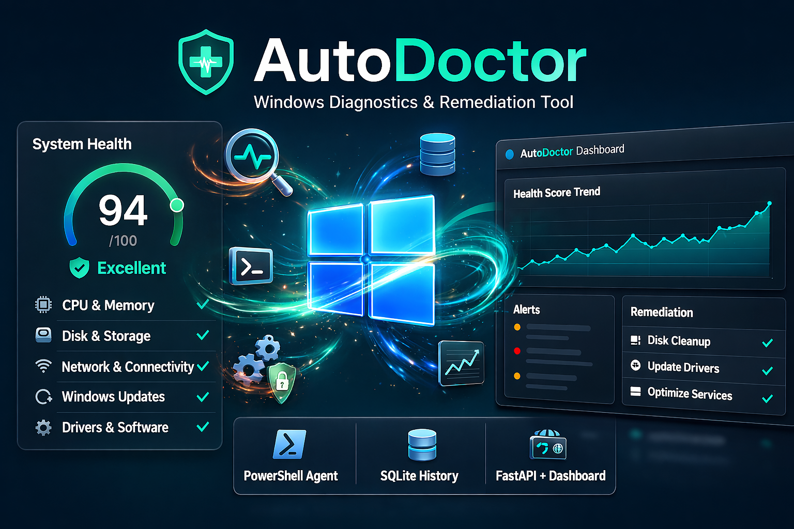

# AutoDoctor

<a href="https://projectindexly.com/autodoctor">
  
</a>
<a href="https://www.microsoft.com/windows">
  
</a>
<a href="https://learn.microsoft.com/powershell/">
  
</a>
<a href="https://www.python.org/downloads/windows/">
  
</a>



AutoDoctor is a Windows diagnostics and remediation tool that combines:

- a PowerShell agent for diagnostics/remediation
- SQLite persistence for local history
- a FastAPI service for structured data access
- a browser dashboard for real-time visualization

Documentation: [projectindexly.com/autodoctor](https://projectindexly.com/autodoctor)
Project Indexly (main repo): [github.com/kimsgent/project-indexly](https://github.com/kimsgent/project-indexly)

## Table of Contents

- [AutoDoctor](#autodoctor)
  - [Table of Contents](#table-of-contents)
  - [What AutoDoctor Does](#what-autodoctor-does)
  - [Architecture](#architecture)
  - [Requirements](#requirements)
  - [Installation Paths](#installation-paths)
    - [A) Installer deployment (recommended for endpoints)](#a-installer-deployment-recommended-for-endpoints)
    - [B) Source/development deployment (`.venv`)](#b-sourcedevelopment-deployment-venv)
  - [Runtime Configuration](#runtime-configuration)
  - [Run and Verify](#run-and-verify)
  - [Build and Packaging](#build-and-packaging)
  - [API Endpoints](#api-endpoints)
  - [Documentation](#documentation)
  - [Disclaimer and Rights](#disclaimer-and-rights)

## What AutoDoctor Does

- Runs host diagnostics (CPU, memory, disk, network, events, updates, drivers, software)
- Computes root-cause summary and health score
- Executes remediation tasks in the full workflow
- Persists diagnostics, alerts, telemetry, and system snapshots to SQLite
- Serves data to dashboard and automation via API

## Architecture

```text
agent/            PowerShell execution engine + modules + DB writers
server/api/       FastAPI app + query layer + Windows service wrapper
server/dashboard/ Static dashboard (Chart.js) with API polling
db/               SQLite database (autodoctor.db)
installer/        Build script + Inno Setup packaging
```

## Requirements

Minimum runtime:

- Windows x64
- Administrator privileges for installer and agent execution
- PowerShell 5.1+

For `system_python` service mode:

- Python 3.12.x
- Packages: `pywin32`, `fastapi`, `uvicorn`

For local build/packaging:

- Python 3.12
- PyInstaller
- Inno Setup 6 (`ISCC.exe`)

## Installation Paths

### A) Installer deployment (recommended for endpoints)

Run the generated installer as Administrator:

- default root: `C:\ProgramData\AutoDoctor`
- choose service mode:
  - `bundled` runtime (default)
  - `system_python` runtime (advanced)

### B) Source/development deployment (`.venv`)

Run from cloned repo. Without overrides, runtime artifacts stay in repo tree:

```powershell
cd .\server\api
python -m venv .venv
.\.venv\Scripts\Activate.ps1
python -m pip install --upgrade pip
python -m pip install pyinstaller fastapi uvicorn pywin32
```

## Runtime Configuration

Important environment variables:

| Variable | Purpose |
|---|---|
| `AUTO_DOCTOR_HOME` | Runtime root override |
| `AUTO_DOCTOR_DB_PATH` | Explicit DB file path |
| `AUTO_DOCTOR_CONFIG_INI` | Explicit INI path |
| `AUTO_DOCTOR_API_HOST` / `AUTO_DOCTOR_API_PORT` | API host/port fallback |
| `AUTO_DOCTOR_API_KEY` | Optional API key enforcement |
| `AUTO_DOCTOR_CORS_ORIGINS` | CORS allow-list override |
| `AUTO_DOCTOR_SYSTEM_PYTHON` | Installer: explicit interpreter path for system mode |

Host/port precedence:

1. Registry (`HKLM\Software\AutoDoctor`)
2. INI (`config\autodoctor.ini`)
3. Environment variables
4. Defaults (`127.0.0.1:8000`)

## Run and Verify

Run bootstrap (safe initial schema/data):

```powershell
powershell -NoLogo -NoProfile -ExecutionPolicy Bypass -File .\agent\Initialize-AutoDoctor.ps1
```

Run full diagnostics + remediation:

```powershell
powershell -NoLogo -NoProfile -ExecutionPolicy Bypass -File .\agent\AutoDoctor.ps1
```

Verify API and dashboard:

```powershell
Invoke-RestMethod http://127.0.0.1:8000/health
Invoke-RestMethod http://127.0.0.1:8000/api/system/latest
```

Dashboard:

- `http://127.0.0.1:8000/dashboard/`

## Build and Packaging

One-click build (PyInstaller + Inno Setup):

```powershell
powershell -NoLogo -NoProfile -ExecutionPolicy Bypass -File .\installer\Build-AutoDoctor.ps1
```

Version is sourced from:

- `VERSION`

Build guide:

- [`installer/BUILD_AND_INSTALL.md`](./installer/BUILD_AND_INSTALL.md)

Installer script:

- [`installer/AutoDoctorInstaller.iss`](./installer/AutoDoctorInstaller.iss)

## API Endpoints

- `GET /health`
- `GET /api/system/latest`
- `GET /api/system/history`
- `GET /api/alerts`
- `GET /api/health`
- `GET /api/modules`
- `GET /api/dashboard/meta`

## Documentation

- Docs home: [projectindexly.com/autodoctor](https://projectindexly.com/autodoctor)
- Local docs source: [`docs/content/autodoctor`](./docs/content/)

Suggested reading order:

1. Getting Started
2. Technical Guide
3. Troubleshooting
4. Reference
5. Developer Guide

## Disclaimer and Rights

AutoDoctor is provided for diagnostics and operational support workflows.
Remediation actions can modify system state and should be run by authorized administrators in controlled contexts.

Dashboard and generated reports include product-specific disclaimer text; keep these notices intact in redistributed builds.
Third-party platform names and trademarks remain the property of their respective owners.
